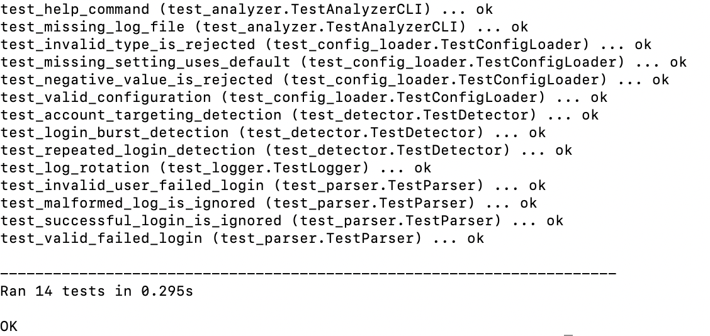
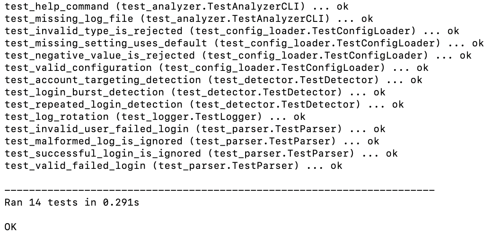
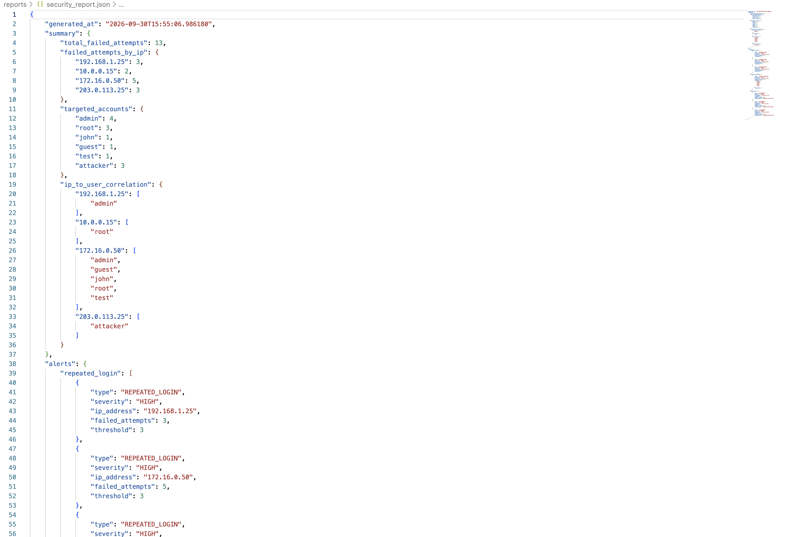

# 🔐 Security Log Analyzer

A Python-based defensive cybersecurity tool that analyzes SSH authentication logs, identifies suspicious failed-login activity, generates security alerts, and produces structured JSON reports.

This project was built as a hands-on cybersecurity portfolio project to practice **log analysis, security monitoring, detection engineering, Python programming, automation, testing, and Git/GitHub workflows**.

---

## 📌 Overview

Authentication logs contain valuable information about attempts to access a system. Manually reviewing these logs can become difficult as the amount of data increases.

The **Security Log Analyzer** automates part of this process by parsing SSH authentication events, correlating activity by source IP address and username, and applying configurable detection rules to identify suspicious login behavior.

The project is designed for **defensive cybersecurity education and authorized security monitoring**.

---

## ✨ Features

The Security Log Analyzer can:

- Parse SSH failed-login events
- Extract usernames, IP addresses, and timestamps
- Handle invalid-user SSH login attempts
- Count failed authentication attempts by IP address
- Track targeted user accounts
- Correlate source IP addresses with targeted accounts
- Detect repeated failed-login attempts
- Detect attempts targeting multiple user accounts
- Detect bursts of failed logins within a time window
- Load detection thresholds from a JSON configuration file
- Generate structured JSON security reports
- Maintain application operational logs
- Automatically rotate application logs
- Handle missing log files through the CLI
- Run automated unit and CLI tests

---

## 🚨 Detection Rules

The analyzer currently implements three main detection rules.

### 1. Repeated Login Detection

Detects a source IP address when the number of failed login attempts reaches or exceeds a configured threshold.

Example:

```text
192.168.1.25 -> 3 failed attempts
```

---

### 2. Account Targeting Detection

Detects a source IP address attempting authentication against multiple unique user accounts.

Example:

```text
Source IP: 172.16.0.50
Unique accounts targeted: 5
Accounts: admin, guest, john, root, test
```

This correlation can help identify a source attempting to access several accounts rather than repeatedly targeting only one account.

---

### 3. Login Burst Detection

Detects multiple failed authentication attempts from the same IP address within a configurable time window.

Example:

```text
Source IP: 192.168.1.25
Failed attempts: 3
Time window: 60 seconds
```

This provides a simple rule-based method for identifying unusually rapid authentication failures.

---

## 🏗️ Project Architecture

```text
                         config.json
                              |
                              v
                         analyzer.py
                        /     |      \
                       /      |       \
                      v       v        v
                  parser   detector   reporter
                      \       |        /
                       \      |       /
                        \     |      /
                         v    v     v
                       Analysis Results
                         /          \
                        v            v
                    Terminal     JSON Report


                       analyzer.py
                            |
                            v
                         logger.py
                            |
                            v
                     analyzer.log
```

### Component Responsibilities

**`analyzer.py`**  
Coordinates the complete analysis workflow and provides the command-line interface.

**`parser.py`**  
Parses SSH authentication log entries and extracts structured security event information.

**`detector.py`**  
Contains the security detection rules used to identify suspicious authentication behavior.

**`config_loader.py`**  
Loads and validates configurable detection thresholds.

**`reporter.py`**  
Displays analysis results and generates the JSON security report.

**`logger.py`**  
Records operational events generated by the analyzer and provides automatic log rotation.

---

## 📁 Project Structure

```text
security-log-analyzer/
│
├── config/
│   └── config.json
│
├── docs/
│   └── screenshots/
│       ├── analyzer-output.png
│       ├── json-report.png
│       └── tests-passing.png
│
├── logs/
│   └── auth.log
│
├── reports/
│
├── src/
│   ├── analyzer.py
│   ├── config_loader.py
│   ├── detector.py
│   ├── logger.py
│   ├── parser.py
│   └── reporter.py
│
├── tests/
│   ├── test_analyzer.py
│   ├── test_config_loader.py
│   ├── test_detector.py
│   ├── test_logger.py
│   └── test_parser.py
│
├── .gitignore
└── README.md
```

Generated application logs, JSON reports, Python cache files, and virtual environments are excluded from version control.

---

## 🛠️ Technologies Used

- **Python 3**
- Python `argparse`
- Python `re`
- Python `json`
- Python `logging`
- Python `unittest`
- Git
- GitHub

The project currently relies primarily on Python's standard library and does not require third-party Python packages.

---

## ⚙️ Requirements

- Python 3.9 or later
- Git
- macOS or Linux recommended

Check your Python installation:

```bash
python3 --version
```

---

## 🚀 Installation

### 1. Clone the repository

```bash
git clone https://github.com/Sankofi7/security-log-analyzer.git
```

### 2. Enter the project directory

```bash
cd security-log-analyzer
```

### 3. Create a virtual environment

```bash
python3 -m venv .venv
```

### 4. Activate the virtual environment

On macOS/Linux:

```bash
source .venv/bin/activate
```

Your Terminal prompt may then show:

```text
(.venv)
```

The current project uses Python's standard library, so no additional Python packages are required.

---

## ▶️ Usage

Run all commands below from the root `security-log-analyzer` directory.

### Run with the default files

```bash
python src/analyzer.py
```

By default, the analyzer uses:

```text
Log file:       logs/auth.log
Configuration:  config/config.json
JSON report:    reports/security_report.json
```

### Display CLI help

```bash
python src/analyzer.py --help
```

### Analyze a custom authentication log

```bash
python src/analyzer.py --log path/to/auth.log
```

or:

```bash
python src/analyzer.py -l path/to/auth.log
```

### Use a custom configuration

```bash
python src/analyzer.py --config path/to/config.json
```

or:

```bash
python src/analyzer.py -c path/to/config.json
```

### Specify a custom report location

```bash
python src/analyzer.py --output reports/custom_report.json
```

or:

```bash
python src/analyzer.py -o reports/custom_report.json
```

### Use all three options together

```bash
python src/analyzer.py \
    -l logs/auth.log \
    -c config/config.json \
    -o reports/security_report.json
```

---

## ⚙️ Configuration

Detection thresholds are stored in:

```text
config/config.json
```

Default configuration:

```json
{
    "repeated_login_threshold": 3,
    "account_targeting_threshold": 3,
    "login_burst_threshold": 3,
    "login_burst_window_seconds": 60
}
```

### Configuration Options

| Setting | Purpose |
|---|---|
| `repeated_login_threshold` | Number of failed attempts required for a repeated-login alert |
| `account_targeting_threshold` | Number of unique accounts required for an account-targeting alert |
| `login_burst_threshold` | Number of failed attempts required within the burst window |
| `login_burst_window_seconds` | Length of the burst detection window in seconds |

Keeping these settings outside the Python source code allows detection behavior to be changed without modifying the detection engine.

---

## 📊 Example Analysis

Example failed-login statistics:

```text
=== SECURITY LOG ANALYZER ===

Total failed login attempts: 13

=== FAILED ATTEMPTS BY IP ===

192.168.1.25 -> 3 failed attempts
10.0.0.15 -> 2 failed attempts
172.16.0.50 -> 5 failed attempts
203.0.113.25 -> 3 failed attempts
```

Example account statistics:

```text
=== TARGETED ACCOUNTS ===

admin -> 4 failed attempts
root -> 3 failed attempts
john -> 1 failed attempt
guest -> 1 failed attempt
test -> 1 failed attempt
attacker -> 3 failed attempts
```

---

## 🚨 Example Security Alerts

### Repeated Login Alert

```text
=== REPEATED LOGIN ALERTS ===

[HIGH ALERT]
Source IP: 192.168.1.25
Failed attempts: 3
Threshold: 3
```

### Account Targeting Alert

```text
=== ACCOUNT TARGETING ALERTS ===

[SUSPICIOUS ACCOUNT TARGETING]
Source IP: 172.16.0.50
Unique accounts: 5
Accounts: admin, guest, john, root, test
```

### Login Burst Alert

```text
=== LOGIN BURST ALERTS ===

[SUSPICIOUS LOGIN BURST]
Source IP: 203.0.113.25
Failed attempts: 3
Time window: 60 seconds
```

---

## 📄 JSON Reporting

The analyzer generates a structured JSON security report at:

```text
reports/security_report.json
```

The report contains information including:

- Report generation timestamp
- Total failed-login attempts
- Failed attempts grouped by IP address
- Targeted accounts
- IP-to-user correlation
- Repeated-login alerts
- Account-targeting alerts
- Login-burst alerts

A simplified example:

```json
{
    "summary": {
        "total_failed_attempts": 13,
        "failed_attempts_by_ip": {
            "192.168.1.25": 3,
            "10.0.0.15": 2,
            "172.16.0.50": 5,
            "203.0.113.25": 3
        }
    }
}
```

Using JSON makes the results easier for other applications, scripts, dashboards, or security tools to process.

---

## 📝 Application Logging

The analyzer maintains its own operational log:

```text
logs/analyzer.log
```

This is different from:

```text
logs/auth.log
```

`auth.log` contains the **security events being analyzed**, while `analyzer.log` records **what the analyzer application itself is doing**.

Example application events:

```text
INFO - Security Log Analyzer started
INFO - Analyzing log file: logs/auth.log
INFO - Found 13 failed login events
INFO - Generated 3 repeated-login alerts
INFO - Generated 1 account-targeting alert
INFO - Generated 3 login-burst alerts
INFO - Security Log Analyzer completed successfully
```

Application logs use Python's `RotatingFileHandler` so the operational log cannot grow indefinitely.

The current configuration keeps the active log at approximately **1 MB** and retains up to **3 backup log files**.

---

## 🧪 Automated Testing

The project contains automated tests for the major components.

From the project root, run:

```bash
python -m unittest discover -s tests -v
```

The current test suite contains **14 automated tests** covering areas such as:

- Standard SSH failed-login parsing
- Invalid-user SSH log parsing
- Malformed log handling
- Successful-login filtering
- Repeated-login detection
- Multi-account targeting detection
- Login-burst detection
- Configuration validation
- Default configuration behavior
- CLI help behavior
- Missing log-file handling
- Application log rotation

A successful test run should finish with:

```text
Ran 14 tests

OK
```

---

## 📸 Screenshots

### Security Analysis

The analyzer processes SSH authentication events and displays detected suspicious activity.



### Automated Tests

The automated test suite verifies the major components and detection logic.



### JSON Security Report

Analysis results and security alerts can also be exported as structured JSON.



---

## 🛡️ Security Use Cases

This project demonstrates concepts relevant to defensive cybersecurity areas such as:

- Security Operations Center (SOC) monitoring
- Authentication-log analysis
- Security event correlation
- Detection engineering
- Incident investigation
- Security automation
- Brute-force pattern detection
- Security reporting

It is designed as a learning project rather than a replacement for a production SIEM or enterprise detection platform.

---

## 🔒 Security and Privacy

The repository uses controlled sample authentication data for demonstration purposes.

Generated operational logs and generated security reports are excluded from Git using `.gitignore`.

When adapting the analyzer to real environments, authentication logs should be handled carefully because they may contain sensitive operational information.

---

## ⚠️ Current Limitations

The current version:

- Focuses primarily on SSH failed-login events
- Uses rule-based detection rather than behavioral or machine-learning detection
- Processes log files locally
- Does not currently monitor logs continuously in real time
- Does not provide a graphical dashboard
- Uses the current year when parsing sample syslog timestamps that do not contain a year
- Uses relatively simple IP extraction and validation
- Supports a limited set of SSH authentication log formats

These limitations provide clear opportunities for future development.

---

## 🔮 Future Improvements

Potential future versions could include:

- Real-time log monitoring
- Support for additional Linux authentication log formats
- Stronger IP-address validation
- IPv6 support improvements
- Additional detection rules
- Detection severity scoring
- CSV report export
- Dashboard visualization
- Email or webhook alerting
- SIEM integration
- Cloud-based log ingestion
- AWS security-log analysis
- Centralized monitoring of multiple systems

---

## 🎯 Skills Demonstrated

This project demonstrates practical experience with:

- Python programming
- Regular expressions
- File processing
- Log parsing
- Security event analysis
- Detection-rule development
- Event correlation
- JSON configuration
- JSON reporting
- Command-line interfaces
- Error handling
- Application logging
- Log rotation
- Automated testing
- Git version control
- GitHub project management
- Technical documentation

---

## 🧠 What I Learned

Building this project provided hands-on experience with turning raw authentication logs into structured security information.

Key lessons included:

- How authentication logs can be parsed programmatically
- How IP addresses and user accounts can be correlated
- How simple detection rules can identify suspicious patterns
- Why detection thresholds should be configurable
- How automated tests protect working functionality when new features are added
- How application logging helps troubleshoot and monitor software
- How Git and GitHub can be used to manage a cybersecurity project professionally

---

## ⚖️ Ethical Use

This project is intended only for:

- Defensive cybersecurity education
- Authorized security monitoring
- Controlled laboratory environments
- Personal cybersecurity learning

Only analyze systems and log data that you own or are explicitly authorized to access.

---

## 👤 Author

**Sankofi7**

Cybersecurity student focused on developing practical skills in defensive security, security monitoring, network security, cloud computing, and cloud security.

GitHub: https://github.com/Sankofi7

---

## 📌 Project Status

**Version:** 1.0 preparation  
**Status:** Functional and tested  
**Automated Tests:** 14 passing

The project is actively maintained as part of a hands-on cybersecurity portfolio.